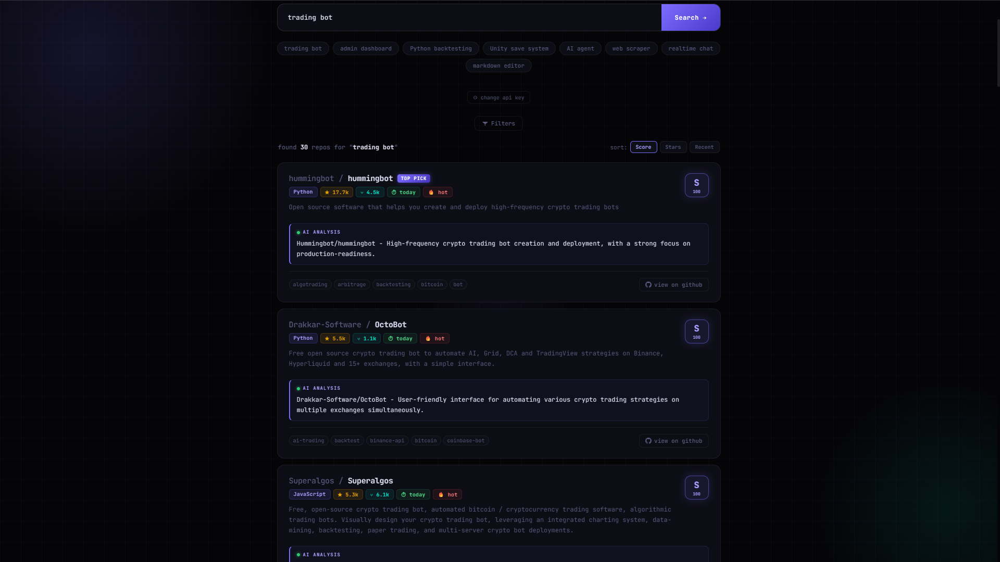
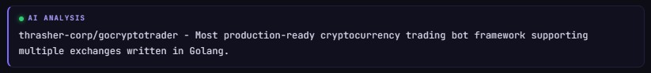

# RepoHunt

RepoHunt is a smarter GitHub discovery tool that helps developers find the **best open-source repositories for any niche**.

Instead of scrolling through hundreds of results on GitHub search, RepoHunt ranks repositories using multiple quality signals and generates AI summaries so you can quickly understand what each project does.

---

## Preview

### Search Interface


### Repository Results


### AI Repository Summary


---

## What it does

Search for something like:

```
trading bot
Unity save system
Python web scraper
AI agent framework
```

RepoHunt will return the **top repositories ranked by quality, relevance, and activity**.

---

## How RepoHunt ranks repositories

Each repository is scored using multiple signals:

- GitHub stars (popularity)
- recent activity
- documentation quality
- description completeness
- open-source license
- topic tags
- query relevance
- community activity

This produces a **Repo Score (0–100)** which helps identify high-quality projects.

---

## Features

- Smart GitHub repository discovery
- AI-generated repository summaries
- Repo scoring system
- Language filtering
- Minimum star filtering
- Recent activity filtering
- Fork exclusion
- Quick search suggestions
- modern developer-focused UI

---

## Example use cases

Developers can use RepoHunt to quickly discover:

- open-source trading bots
- AI agent frameworks
- Unity tools and plugins
- Python automation projects
- backend frameworks
- useful developer utilities

---

## Why RepoHunt exists

GitHub search is great, but it often:

- surfaces irrelevant repositories
- prioritizes popularity over quality
- makes niche discovery difficult

RepoHunt tries to solve this by combining **ranking signals and AI summarization**.

---

## Tech stack

Frontend:
- HTML
- CSS
- JavaScript

API integrations:
- GitHub API
- Groq API (for AI summaries)

Font:
- JetBrains Mono

---

## Running locally

Clone the repository:

```
git clone https://github.com/Sujosh-Jana/repohunt.git
```

Then open the main HTML file in your browser:

```
index.html
```

---

## Future improvements

Planned features include:

- semantic repository search
- repository similarity recommendations
- curated repo collections
- developer trend analysis
- API access for repo discovery

---

## Contributing

Contributions are welcome.

If you have ideas for improving the ranking system, search quality, or UI, feel free to open an issue or submit a pull request.
